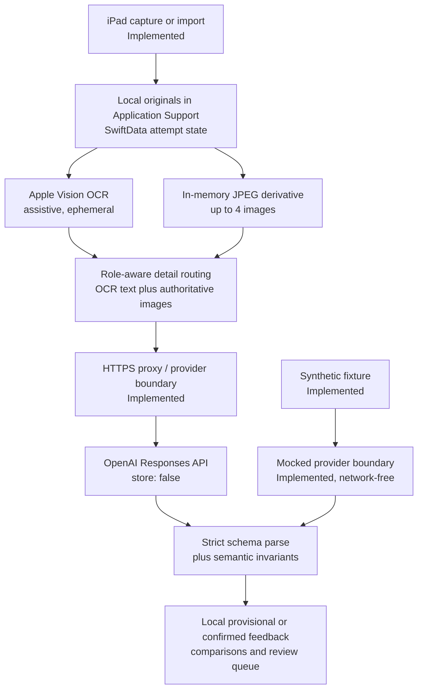

# Building a Testable Multimodal Feedback Pipeline on iPad with the OpenAI Responses API

An engineering case study about turning mixed visual evidence into a feedback contract without confusing valid JSON with a correct diagnosis.

> **Portfolio status:** Linxol is an implemented native iPad learning application. This sanitized case study covers one narrow subsystem, not the production repository. Its one-case, mock-only offline demo is implemented and tested. Security code, credentials, production URLs, signing data, private prompts, and learner data are excluded. Public assets are synthetic only.

## The problem

A student can submit several kinds of evidence: the problem statement, handwritten work, and a reference solution. Those images do not have equal meaning. A reference page may establish the expected method, while learner work is the authority for what the student wrote. OCR can make printed material cheaper to process, but a transcription error in handwriting must not be promoted into a diagnosis.

The engineering goal was therefore narrower than “explain this image.” The pipeline must identify one primary, visible learning point or abstain. It must preserve evidence roles, produce a predictable response shape, reject invalid state transitions, and keep review behavior stable after the provider call ends.

The current wire contract returns exactly one nullable `feedbackPoint`. A successful diagnosis contains one primary point; insufficient or non-actionable evidence produces `null`. Swift maps that value to a 0-or-1 `feedbackAtoms` collection for compatibility with the app’s domain model.

## Learner-to-feedback workflow

The iPad app captures or imports up to four images. Originals stay under Application Support; project, attempt, evidence-role, feedback, and comparison state use SwiftData. Analysis uses non-persistent JPEG derivatives with a 2,048-pixel longest edge, quality 0.85, and 16 MiB total limit.

Apple Vision OCR is assistive and local. Usable printed context or reference OCR can accompany a lower-detail image. Learner and mixed evidence stay high-detail because handwriting, corrections, notation, and layout may carry meaning. OCR failure falls back to high-detail image evidence.

An app-facing, provider-neutral `StudyAIService` boundary sends the selected context through an HTTPS proxy, although some persisted provider/model metadata remains coupled. The proxy constructs one multimodal OpenAI Responses API request with `store: false`, prompt version `linxol-feedback-v2.3`, schema version `linxol-feedback-schema-v2`, and strict JSON Schema Structured Outputs. The audited configuration selected `gpt-5.6-terra`, but runtime model selection is environment-configured rather than an immutable architectural property.

After JSON parsing, semantic invariants check outcome consistency, bounds, confidence, memory identifiers, and abstention. Valid results are stored provisionally in SwiftData. Confirmation, comparison metadata, and the rule-based review queue remain local and deterministic for fixed inputs.

## Architecture



## Three engineering decisions

### 1. OCR is assistive; the image remains authoritative

Printed context and reference pages often contain stable text. When OCR is usable, sending that transcription with a lower-detail image can reduce visual input while retaining the source image as a cross-check. This is an efficiency decision, not a claim that OCR understands the problem.

Learner evidence needs a different policy. Handwriting, crossed-out steps, arrows, spacing, signs, and corrections may be essential to locating the first divergence. Even a plausible OCR string can silently change a symbol. Learner-work and mixed evidence therefore remain high-detail, and their OCR is treated as low-trust auxiliary context. OCR disagreement never overrides the visible learner image.

OCR failure also should not turn a usable image into a technical failure. The fallback is the high-detail derivative, not cancellation of the request. The tradeoff is explicit: lower detail can reduce token use and latency for readable printed material, while high detail spends more of both to preserve fidelity and robustness where mistakes are easier to introduce.

### 2. Structured Outputs constrain shape, not meaning

Strict JSON Schema gives the Swift client a bounded contract: known keys, controlled classifications, limited strings, one nullable point, and explicit abstention outcomes. This removes a large class of parsing branches and makes persistence rules testable. The proxy and client still validate the parsed value because a well-formed object can violate application invariants even when its JSON shape is acceptable.

Shape is only the first layer. A response can satisfy every required field and still select a downstream symptom instead of the first learner error. It can also make a grammatically convincing claim that is not visible in the evidence. Deterministic semantic assertions are therefore separate from schema validation: the evaluator must check the expected first error, grounding in visible work, and absence of unsupported claims.

### 3. Keep state deterministic and provider evaluation replaceable

Canonical attempt, feedback, comparison, and review state stays in SwiftData. Confirmation and queue scheduling do not require another provider call. That keeps user actions reproducible and prevents a later model response from silently rewriting review history. The queue is ordered by explicit status, due date, and identifier rules, subject to fixed time and calendar inputs.

The app-facing service boundary also makes provider behavior replaceable in tests. A mocked provider can return a controlled Responses-shaped payload through the same public-safe parsing boundary, allowing regressions to be reproduced without a key or network call. The public demo now exercises the sanitized production v2.3 nullable-`feedbackPoint` contract. The separate older internal Feedback V2 harness remains historically useful but is not presented as contract-aligned.

## A schema-valid semantic failure

Consider one synthetic case:

- Problem: `2(x + 3) = 14`
- Student work: `2x + 3 = 14 → 2x = 11 → x = 5.5`
- Reference: `2x + 6 = 14 → x = 4`

The first visible error is failing to distribute `2` to `+3`. The later division is internally consistent with the student’s incorrect intermediate equation. The following compact illustration passes this repository’s sanitized current-contract validator and cites visible work, but diagnoses the wrong step:

```json
{
  "analysisOutcome": "feedbackAvailable",
  "feedbackPoint": {
    "signalType": "actualError",
    "category": "execution",
    "confirmedPoint": "The division from 2x = 11 to x = 5.5 is incorrect.",
    "whyImportant": "This final calculation changes the answer shown in the work.",
    "keyIdea": "Divide both sides consistently.",
    "nextAction": "Recheck the final division after isolating x.",
    "confidence": 0.92
  },
  "memoryEvaluations": [],
  "missingEvidenceKinds": [],
  "evidenceGuidance": "",
  "metadata": {
    "promptVersion": "linxol-feedback-v2.3",
    "schemaVersion": "linxol-feedback-schema-v2"
  }
}
```

**Contract-valid does not mean semantically correct.** The automated contract-only baseline accepts this response. It cites visible learner work, but selects the wrong first error and falsely claims that the final division is incorrect. The layered evaluator separates visible grounding from diagnostic correctness and rejects it.

| Check | Wrong candidate |
| --- | --- |
| Contract valid | Pass |
| First error correct | Fail |
| Grounded in visible work | Pass |
| No unsupported claim | Fail |
| Final semantic decision | Reject |

The contract validator is working correctly: Structured Outputs constrain shape, not mathematical or pedagogical correctness. The baseline fails because contract validity alone is an incomplete acceptance rule.

## Evaluation strategy and current status

The implemented public suite runs two deterministic provider modes against one fixture. The correct response passes all four checks. The contract-valid wrong response passes grounding but fails first-error and unsupported-claim checks, so the final decision is rejection. Both paths are tested with zero network calls.

Earlier production-repository checks and the older internal Feedback V2 harness remain separate evidence. This public suite neither aligns nor replaces that older harness.

## Privacy and data boundaries

Kept locally:

- original evidence;
- SwiftData project, attempt, feedback, and comparison state;
- manual notes.

Temporarily processed or transmitted:

- ephemeral OCR;
- request-relevant project and item context;
- selected prior feedback memory and evidence-role hints;
- one to four in-memory JPEG derivatives;
- the request routed through the HTTPS proxy to OpenAI.

Persisted after validation:

- analysis outcome;
- provisional or confirmed feedback;
- comparison metadata.

The Responses API request includes `store: false`. The audited proxy code does not define a learner-content database or upload store. Neither fact is a guarantee of privacy or complete production security: hosting, provider processing, authentication, retention, deployment, and operational verification are separate concerns and are intentionally outside this public case study.

Reviewer evidence: [synthetic fixture](fixtures/synthetic-first-error/case.json), [sanitized contract](src/feedback-contract.mjs), [offline evaluator](src/offline-evaluator.mjs), [regression test](test/offline-demo.test.mjs), and [privacy and measurement](docs/privacy-and-measurement.md).

## Reproduction status

Run from the repository root:

```sh
npm test
```

Tested with Node `v24.18.0`. No dependency installation, API key, or network connection is required. The SVG files are deterministic, mock-only public evidence assets and are not submitted to a live API.

Stable excerpt from the real run:

```text
correct-candidate contract=PASS firstError=PASS grounding=PASS unsupportedClaim=PASS finalDecision=ACCEPT networkCalls=0
semantic-failure-baseline contract=PASS baselineDecision=ACCEPT
semantic-failure-layer firstError=FAIL grounding=PASS unsupportedClaim=FAIL finalDecision=REJECT networkCalls=0
tests 2
pass 2
fail 0
```

## Metrics

Instrumentation capability for provider usage, two distinct latency boundaries, and configured cost estimation was audited. The optional three-run plan is documented but not executed. No live measurement was made, and historical observations are not imported as portfolio results.

**Not measured in the public offline demo.**

## Limitations

- No real-learner dataset will be published, and no educational-outcome validation has been performed.
- The system provides no accuracy, diagnostic, zero-hallucination, or guaranteed-privacy claim.
- The evaluator is one synthetic, case-specific regression test, not a measurement of general model or educational accuracy.
- Swift persistence tests and physical-device behavior were not rerun during the read-only audit.
- Runtime model selection is environment-configured while persisted model metadata is currently static, creating a drift risk.
- Deterministic review ordering assumes fixed data, time, and calendar settings.
- Generated feedback editing, individual exclusion, and individual deletion were not verified in the review UI.
- Production authentication, App Attest, rate limiting, deployment, and other security controls are outside this case study’s verified scope.

## What this test proves—and does not prove

The test proves that one response can satisfy the sanitized current contract while being semantically wrong; contract and semantic evaluation can be tested independently; a deterministic regression can reject this known failure; visible grounding differs from correct diagnosis; and the public demo needs no live provider.

It does not measure how often a live model produces or avoids the failure, exercise the production provider path, establish general accuracy, generalize to arbitrary algebra or other subjects, demonstrate improved educational outcomes, eliminate hallucinations, or guarantee privacy or production security.

## Official OpenAI references

- [Responses API guide](https://developers.openai.com/api/docs/guides/migrate-to-responses)
- [Structured Outputs guide](https://developers.openai.com/api/docs/guides/structured-outputs)
- [Evaluation best practices](https://developers.openai.com/api/docs/guides/evaluation-best-practices)
